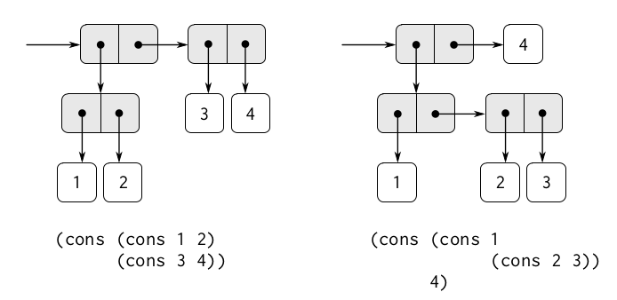

# Упражнение 4

## Quote

```scheme
;; оценката на (quote <израз>) е самият <израз>
> (+ 1 2) ;; => 3
> (quote (+ 1 2)) ;; => (+ 1 2)

;; алтернативен запис на quote
> '(+ 1 2) ;; => (+ 1 2)
```

## Наредени двойки

Съставен тип данни, който реализира наредена двойка `(A . B)`, oбразувана от две произволни стойности.


```scheme
;; cons образува наредена двойка от оценките
;; на подадените му изрази
> (cons 1 2) ;; => '(1 . 2)

;; наредена двойка от оценките на 1 и #t - '(1 . #t)
> (cons 1 #t)

;; наредена двойка от оценките на 1 и (+ 2 3) - '(1 . 5)
> (cons 1 (+ 2 3))     

;; използваме quote, за да дефинираме наредената двойка
> (define x '(1 . 2)) ;; => '(1 . 2)

;; car връща първия елемент от наредената двойка
> (car x) ;; => 1

;; cdr връща втория елемент от наредената двойка
> (cdr x) ;; => 2

;; предикатът pair? проверява дали подаденият му
;; аргумент е наредена двойка
> (pair? x) ;; => #t
```

Може някой от елементите на наредената двойка да е друга наредена двойка (да ги влагаме).



## Списъци

Рекурсивна дефиниция:

  - Празният списък `()` е списък
  - `(h . t)` е списък ако `t` е списък
      - `h` — глава на списъка (head)
      - `t` — опашка на списъка (tail)

```scheme
;; eквивалентни записи
> (cons 1 (cons 2 (cons 3 '()))) ;; => '(1 2 3)
> '(1 . (2 . (3 . ())))          ;; => '(1 2 3)
> '(1 2 3)                       ;; => '(1 2 3)
> (list 1 2 3)                   ;; => '(1 2 3)

;; списъците могат да съдържат различни типове данни
> '(1 \e "string" (lambda (x) (+ x 1)) #t)

> (car '(1 2 3)) ;; => 1
> (cdr '(1 2 3)) ;; => '(2 3)

;; eквивалентни записи
> (car (cdr '(1 2 3))) ;; => 2
> (cadr '(1 2 3))      ;; => 2

;; eквивалентни записи
> (cdr (cdr '(1 2 3))) ;; => '(3)
> (cddr '(1 2 3))      ;; => '(3)

> (car (cdr (cdr '(1 2 3)))) ;; => 3
> (cdr (cdr (cdr '(1 2 3)))) ;; => '()
```

## Вградени функции за работа със списъци

```scheme
;; проверява дали списъкът е празен
> (null? '(1 2 3)) ;; => #f
> (null? '())      ;; => #t

;; проверява дали подаденият аргумент е списък
> (list? '(1 2 3)) ;; => #t
> (list? '(1 . 2)) ;; => #f

;; построява списък с оценките на подадените му аргументи
> (list 1 (+ 1 1) 3) ;; => '(1 2 3)
;; сравнете със следния запис
> '(1 (+ 1 1) 3)     ;; => '(1 (+ 1 1) 3)

;; връща дължината на списъка
> (length '(1 2 3)) ;; => 3

;; конкатенира аргументите си в нов списък
> (append '(1 2 3) '() '(4 5)) ;; => '(1 2 3 4 5)

;; обръща наредбата на елементите в списъка
> (reverse '(1 2 3)) ;; => '(3 2 1)

;; проверява дали подаденият елемент се среща в списъка
> (member 2 '(1 2 3 4)) ;; => '(2 3 4)
> (member 5 '(1 2 3 4)) ;; => #f
```

## Линейно обхождане на списъци

```scheme
;; пример - функция, която намира сумата на
;; елементите на даден списък с числа
(define (sum lst)
  (if (null? lst)
      0
      (+ (car lst) (sum (cdr lst)))))

> (sum '(1 2 3)) ;; => 6
```

Нищо ново тук! Oтново имаме:

- дъно - празен ли е списъкът
- рекурсивно извикване с "опашката" на списъка (списъка без първия си елемент)

## =, eq?, eqv? и equal?

[Отговор в stackoverflow с примери](https://stackoverflow.com/questions/16299246/what-is-the-difference-between-eq-eqv-equal-and-in-scheme)

Tl;DR

- използваме `=` когато работим с числа
- използваме `eqv?` когато работим с прости типове
- използваме `equal?` когато работим и със списъци
- не използваме `eq?`, oсвен ако знаем какво правим (а ние не знаем)

Ако скоростта не е фактор, най-безопасно е да използваме `equal?`.

---

## Задачи

1. Дефинирайте функция `(my-length lst)` , която връща броя на елементите в подадения списък

2. Дефинирайте функция `(nth lst n)` , която връща елемента на позиция n в подадения списък

2. Дефинирайте функция `(my-member element lst)`, която проверява дали елементът `element` се съдържа в списъка `lst`  

    ```scheme
    > (my-member 2 '(1 2 3 4)) ;; => '(2 3 4)
    > (my-member 5 '(1 2 3 4)) ;; => #f
    ```

3. Дефинирайте функция `(my-reverse lst)`, която обръща последователността на елементите в списъка lst

    ```scheme
    > (my-reverse '(1 2 3)) ;; => '(3 2 1)
    ```

4. Дефинирайте функция `(my-take lst number)`, която връща списъка от първите `number` елемента на списъка `lst`

    ```scheme
    > (my-take '(1 2 3) 2) ;; => '(1 2)
    > (my-take '(1 2 3) 4) ;; => '(1 2 3)
    ```

5. Дефинирайте функция `(my-drop lst n)`, която връща списъка `lst` без първите `n` елемента от него

    ```scheme
    > (my-drop '(1 2 3) 2) ;; => '(3)
    > (my-drop '(1 2 3) 4) ;; => '()
    ```

6. Дефинирайте функция `(remove lst element)`, която връща списъка `lst`, в който са премахнати всички елементи, равни на `element`

    ```scheme
    > (remove '(1 2 3 3 4) 3) ;; => '(1 2 4)
    ```

8. Дефинирайте функции `(all? lst predicate)`, която проверява дали всички елементи от подадения списък изпълняват условието `predicate`

9. Дефинирайте функция `(any? list predicate)`, която проверява дали някой от елементите от подадения списък изпълнява условието `predicate`

10. Дефинирайте функция `(my-filter predicate lst)`, която връща списък от елементите на списъка `lst`, които изпълняват условието `predicate`

    ```scheme
    > (filter odd? '(1 2 3 4 5)) ;; => '(1 3 5)
    ```

11. Дефинирайте функция `(my-map func lst)`, която връща прилага функцията `func` над всеки елемент в списъка `lst`

    ```scheme
    > (map (lambda (x) (+ x 1)) '(1 2 3)) ;; => '(2 3 4)
    ```
